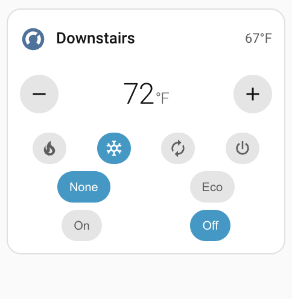
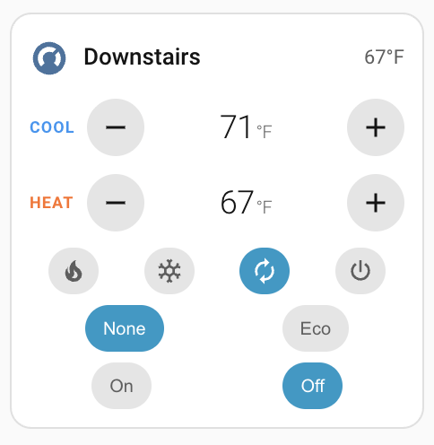
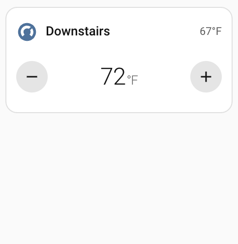
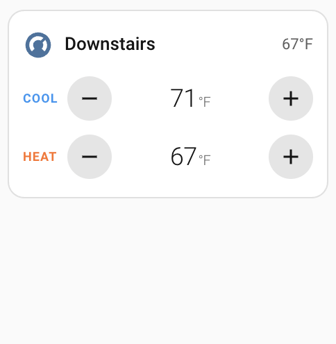

# Smooth Thermostat Card

A compact, debounced thermostat card for Home Assistant Lovelace. Designed for the modern Sections view and mobile dashboards — small enough to fit two aside on a phone, with a full GUI editor and optimistic UI that doesn't fire a service call on every tap.

<table>
  <tr>
    <td align="center">
      <br>
      <sub><b>Single setpoint</b> — heat / cool / auto, all rows enabled</sub>
    </td>
    <td align="center">
      <br>
      <sub><b>Range setpoint</b> — heat_cool, all rows enabled</sub>
    </td>
  </tr>
  <tr>
    <td align="center">
      <br>
      <sub>Compact — header + target temp only</sub>
    </td>
    <td align="center">
      <br>
      <sub>Compact — header + cool / heat rows</sub>
    </td>
  </tr>
</table>

## Features

- **Debounced updates** — rapid +/- taps are coalesced into one `climate.set_temperature` call after a configurable delay (default 750ms)
- **Optimistic UI** — the displayed target temperature updates immediately and pulses while pending
- **Full GUI editor** — all options configurable from the dashboard, no YAML required
- **Range thermostats supported** — handles `target_temp_high` / `target_temp_low` for `heat_cool` mode
- **Compact layout** — uses container queries to shrink gracefully
- **Optional rows** — toggle HVAC modes, presets, and fan modes independently

## Install

### HACS (recommended)

1. Open HACS → Frontend → ⋮ → Custom repositories
2. Add this repo's URL, category **Lovelace**
3. Install **Smooth Thermostat Card**
4. Refresh your dashboard

### Manual

1. Download `smooth-thermostat-card.js` from the latest release
2. Copy it to `<config>/www/`
3. Add a resource: Settings → Dashboards → ⋮ → Resources → Add
   - URL: `/local/smooth-thermostat-card.js`
   - Type: JavaScript Module

## Configuration

Add the card from the UI — it will appear as **Smooth Thermostat Card** in the picker.

Or in YAML:

```yaml
type: custom:smooth-thermostat-card
entity: climate.living_room
name: Living Room
show_current: true
show_modes: true
show_preset: false
show_fan: false
step: 0.5
debounce_ms: 750
```

| Option         | Type    | Default          | Description                                                  |
| -------------- | ------- | ---------------- | ------------------------------------------------------------ |
| `entity`       | string  | **required**     | A `climate.*` entity                                         |
| `name`         | string  | friendly name    | Override the displayed name                                  |
| `icon`         | string  | state icon       | Override the displayed icon                                  |
| `show_current` | boolean | `true`           | Show the current room temperature in the header             |
| `show_modes`   | boolean | `true`           | Show HVAC mode buttons (heat / cool / off / etc.)            |
| `show_preset`  | boolean | `false`          | Show preset mode chips (eco / comfort / away)                |
| `show_fan`     | boolean | `false`          | Show fan mode chips                                          |
| `step`         | number  | entity step or 0.5 | Increment per +/- tap                                      |
| `debounce_ms`  | number  | `750`            | Delay before sending the temperature change                  |
| `min_temp`     | number  | entity default   | Override the minimum temperature                             |
| `max_temp`     | number  | entity default   | Override the maximum temperature                             |

## Development

```bash
npm install
npm run build       # production build → dist/smooth-thermostat-card.js
npm run watch       # rebuild on change
```

## License

MIT
